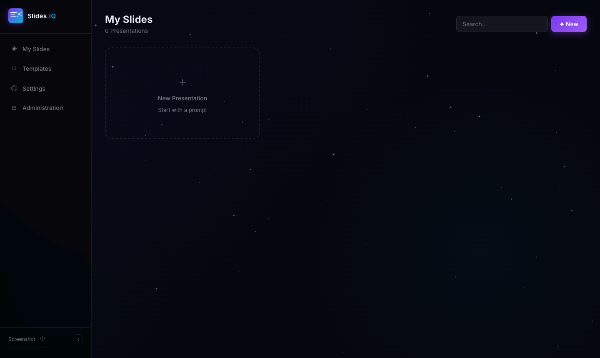

```
 ____   _     ___ ____   _____ ____      ___  ___  
/ ___| | |   |_ _|  _ \ | ____/ ___|    |_ _|/ _ \
\___ \ | |    | || | | ||  _| \___ \  _  | || | | |
 ___) || |___ | || |_| || |___ ___) |(_) | || |_| |
|____/ |_____|___|____/ |_____|____/    |___|\__\_\
```

> Open-source AI presentation builder — MIT licensed, self-hostable.

**Stack:** Node.js · Express · SQLite · Vanilla JS SPA · WebSocket · Multi-Provider AI

---

## What is Slides.IQ?

Slides.IQ turns a text prompt into a fully styled, self-contained HTML presentation in seconds. It streams slide content directly from your chosen AI provider into a live preview, supports multi-user access with roles and per-presentation permissions, and lets audiences follow along in real time via WebSocket. Presentations are stored as portable HTML files and can be exported to PDF or shared via a public link.

---



---

## Features

- **Multi-provider AI** — Anthropic Claude, OpenAI, Mistral, Google Gemini (configurable per instance by admin)
- **Live SSE streaming** — slides appear word by word as the AI generates them
- **Multi-user auth** — roles (user / admin), per-presentation share permissions (read / write / delete)
- **5 built-in design templates** — Cosmic Dark, Ultraminimal, Neon Terminal, Executive Suite, Aurora Gradient
- **Custom templates** — create your own or import from a PPTX file
- **File upload context** — attach PDF, Word, Excel, PPTX, images, CSV to guide generation
- **Per-slide AI editing** — edit or insert individual slides without regenerating the whole deck
- **Version history** — up to 20 versions per presentation, one-click restore
- **PDF export** (Puppeteer) and standalone HTML download
- **Public sharing** — token link + QR code; or per-user permission grants
- **Live audience mode** — WebSocket broadcast so viewers follow the presenter in real time
- **Keyboard navigation** — arrows, fullscreen, overview grid, speaker notes
- **Multilingual UI** — English, German, Italian, Dutch, Polish
- **Brand settings** — colors, font, tagline, tone — per user
- **Admin panel** — global AI provider config, user management (create, edit, activate/deactivate, reset password)

---

## Prerequisites

- Node.js 18 or later
- API key for at least one supported AI provider (configured in the Admin panel after setup)

---

## Quick Start

```bash
git clone <repo-url> slides-iq
cd slides-iq
npm install
npm run dev
```

Open `http://localhost:3000`. On first launch you will be prompted to create an admin account. After setup, go to **Administration → KI-Anbieter** to enter your AI provider API key.

> **Note:** The app no longer reads `ANTHROPIC_API_KEY` from `.env` for generation. All API keys are configured through the Admin panel and stored in the database.

---

## Environment Variables

| Variable | Required | Default | Description |
|---|---|---|---|
| `PORT` | No | `3000` | HTTP server port |
| `SESSION_SECRET` | No | random | Express session secret — **set this in production** |
| `BASE_URL` | No | auto-detect | Base URL used in public share links (e.g. `https://slides.example.com`) |
| `DB_PATH` | No | `./data/nexus.db` | Path to the SQLite database file |

---

## Scripts

| Command | Description |
|---|---|
| `npm install` | Install dependencies |
| `npm start` | Start production server (`node server.js`) |
| `npm run dev` | Start dev server with hot-reload (`node --watch server.js`) |

---

## Architecture Overview

```
Browser (Vanilla JS SPA)
        |  REST + SSE + WebSocket
        v
Express Server (server.js)
  ├── routes/auth.js          — Authentication, user management
  ├── routes/presentations.js — CRUD, sharing, export, versioning
  ├── routes/templates.js     — Template management, PPTX analysis
  ├── routes/ai.js            — AI generation (rate-limited, SSE)
  └── routes/admin.js         — Admin: global AI settings
        |
        ├── services/claude.js      — Multi-provider AI client (Claude / OpenAI / Mistral / Gemini)
        ├── services/pdf.js         — Puppeteer PDF rendering
        ├── services/fileParser.js  — Multi-format file parsing
        ├── services/aiProvider.js  — Provider settings resolver
        └── database.js             — SQLite (better-sqlite3)
```

See [`docs/architecture.md`](docs/architecture.md) for a detailed breakdown.

Additional references:

- [`docs/api.md`](docs/api.md) — Full API endpoint reference
- [`docs/database.md`](docs/database.md) — Schema, migrations, indexes
- [`docs/presentation-format.md`](docs/presentation-format.md) — HTML slide format spec
- [`docs/development.md`](docs/development.md) — Developer guide

---

## License

Slides.IQ is open source and released under the **MIT License**. You are free to use, modify, and distribute it — including for commercial purposes. Contributions are welcome.
